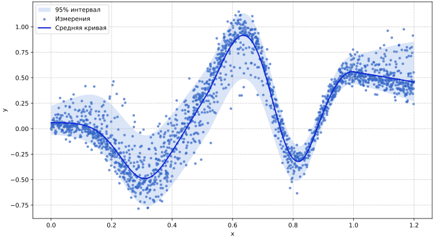

# Вероятностная регрессия

Обычная регрессия в первую очередь моделирует условное среднее. Вероятностная регрессия моделирует условное распределение ответа целиком. Поэтому признаки могут объяснять не только положение распределения, но и разброс, асимметрию, хвосты или вероятность структурного нуля.

## Параметры условного распределения

Обычная линейная регрессия описала бы условное среднее наблюдений. Но неопределённость вокруг среднего тоже является частью предсказания: её можно увидеть как меняющийся разброс вокруг линии среднего.

Вероятностная регрессия позволяет модели описывать и среднее, и этот разброс.

Для семейства с `K` параметрами общая форма модели такова:

$$
Y_i \mid x_i \sim D(\theta_{i1}, \ldots, \theta_{iK}),
\qquad
g_k(\theta_{ik}) = \eta_{ik}.
$$

У каждого параметра есть собственный предиктор. В линейном случае он имеет вид

$$
\eta_{ki} = \beta_{k,0} + \beta_{k,1}x_{1i} + \ldots + \beta_{k,p_k}x_{p_ki}.
$$

У каждого параметра могут быть собственные признаки, коэффициенты и штрафы. Например, признаки, влияющие на средний уровень, не обязаны совпадать с признаками, влияющими на разброс.

## Классы прикладных задач

**Гетероскедастичность.** Пусть средняя цена квартиры растёт с площадью, но разброс цен у больших квартир тоже выше. Тогда можно моделировать не только среднее $\mu$, но и масштаб $\sigma$ как функцию признаков.

**Положительный ответ.** Время ожидания, расходы и концентрации не могут быть отрицательными. Если нормальная модель иногда предсказывает невозможные отрицательные значения, уместнее выбрать $\operatorname{Gamma}$(гамма-распределение), $\operatorname{Weibull}$(распределение Вейбулла) или $\operatorname{LogNormal}$(логнормальное распределение).

**Счётные данные и избыток нулей.** Для числа обращений, покупок или дефектов естественны $\operatorname{Poisson}$(распределение Пуассона) и $\operatorname{NegBin}$(отрицательно-биномиальное распределение). Если нулей существенно больше, чем объясняет обычная счётная модель, может понадобиться модель с избыточными нулями.

**Асимметрия и тяжёлые хвосты.** Если данные заметно несимметричны или в них встречаются значения, слишком далёкие для нормального распределения, можно выбрать распределение с асимметрией или тяжёлыми хвостами: например, $\operatorname{SkewNormal}$(асимметричное нормальное) или распределение Стьюдента $t$.
