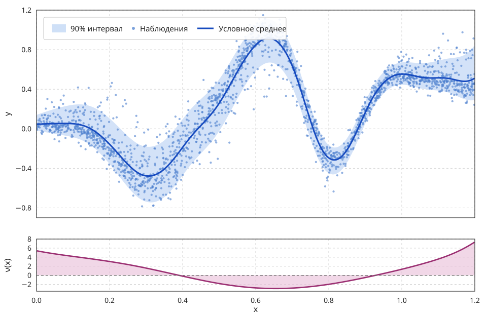

# Сплайн-предикторы положения, масштаба и асимметрии

Полный код примера находится в [`examples/a1_skew_normal.rs`](https://github.com/hexqnt/gamlss/blob/master/examples/a1_skew_normal.rs).

Предыдущие модели поочерёдно усложняли нормальное условное распределение: сначала признаки объясняли только линейное среднее, затем собственный предиктор появился у масштаба. Теперь добавим нелинейные предикторы, явную асимметрию распределения и прикладной оптимизатор с поиском шага. Каждому параметру семейства по-прежнему соответствует отдельный типизированный блок.

## Данные `a1`

Встроенный набор данных содержит 2000 пар $(x_i,y_i)$ с $x\in[0,1.2]$. Он загружается из `gamlss-datasets` без операций ввода-вывода во время выполнения и дополнительных выделений памяти:

```rust,ignore
{{#include ../../../examples/a1_skew_normal.rs:data}}
```

Зависимость среднего от `x` явно нелинейна. Ширина облака также меняется по диапазону признака, а форма отклонений не везде симметрична. На рисунке показаны результат оценивания и отдельная кривая параметра асимметрии:



Отклик принимает отрицательные значения, поэтому гамма- и логнормальное распределения на исходной шкале не подходят. Асимметричное нормальное распределение определено на всей вещественной прямой и позволяет моделировать наблюдаемую асимметрию без преобразования `y`.

## Почему параметризация через среднее и стандартное отклонение

В примере используется `SkewNormalMeanSd`, параметры которой на естественной шкале имеют прямой смысл:

$$
Y_i\mid x_i \sim \operatorname{SN}_{\text{mean/sd}}\bigl(m_i,s_i,\nu_i\bigr),
\qquad
\mathbb E[Y_i\mid x_i]=m_i,
\qquad
\operatorname{SD}(Y_i\mid x_i)=s_i.
$$

Параметр $\nu_i$ управляет направлением и силой асимметрии; при $\nu_i=0$ семейство совпадает с нормальным распределением. Параметризация через среднее и стандартное отклонение выбрана потому, что первый сплайн остаётся условным средним даже при меняющемся $\nu(x)$.

Link-функции в модели имеют вид

$$
m_i=\eta_{m,i},
\qquad
s_i=\exp\!\left(\operatorname{clamp}(\eta_{s,i},-8,2)\right),
\qquad
\nu_i=\eta_{\nu,i}.
$$

`ClampedLog<-8, 2>` гарантирует положительное стандартное отклонение и ограничивает экстремальные значения масштаба во время оптимизации. В найденном решении ограничения не активны.

## Три сплайн-предиктора

Для каждого параметра строится собственный базис кубических B-сплайнов:

$$
\eta_{r}(x)=\sum_{j=0}^{K_r-1}\beta_{r,j}B_{r,j}(x),
\qquad
r\in\{m,s,\nu\}.
$$

`OpenUniformSplineDesign::from_data` запоминает диапазон обучающих `x`, размещает открытый равномерный базис на этом диапазоне и вычисляет только локально ненулевые функции для каждой строки. Полная плотная матрица плана не строится.

| Параметр | Маркер | Число базисных функций | Link-функция | Вес штрафа |
| --- | --- | ---: | --- | ---: |
| Условное среднее $m(x)$ | `Mean` | 20 | `Identity` | 0.05 |
| Стандартное отклонение $s(x)$ | `Sigma` | 14 | `ClampedLog<-8, 2>` | 0.10 |
| Асимметрия $\nu(x)$ | `Nu` | 12 | `Identity` | 0.01 |

Всего оптимизатор видит $20+14+12=46$ коэффициентов.

```rust,ignore
{{#include ../../../examples/a1_skew_normal.rs:model}}
```

Смещения вычисляются из `len()` предыдущих блоков. В результате структура плоского вектора коэффициентов остаётся явной, а соответствие `(Mean, Sigma, Nu)` требованиям семейства проверяется при компиляции и при построении модели.

## Штрафы P-сплайнов

Большой базис сам по себе только даёт модели возможность изгибаться. Гладкость задаёт `PreparedDifferencePenalty` второго порядка. Для одного блока с $K$ коэффициентами библиотека добавляет

$$
J_2(\boldsymbol\beta)
=\frac{\lambda}{K-2}
\sum_{j=0}^{K-3}
\left(\beta_{j+2}-2\beta_{j+1}+\beta_j\right)^2.
$$

Комбинацию базиса B-сплайнов и штрафа на разности обычно называют P-сплайном. Штраф подавляет резкие изменения наклона соседних коэффициентов, но не штрафует их постоянный и линейный профили.

В этом примере числа базисных функций и значения $\lambda$ зафиксированы вручную.

Модель использует `ObjectiveScale::Mean`, поэтому оптимизируется

$$
\mathcal L(\boldsymbol\beta)
=\frac{1}{n}\sum_{i=1}^{n}-\log p(y_i\mid m_i,s_i,\nu_i)
+J_m+J_s+J_\nu.
$$

Усреднение делает характерный масштаб правдоподобия и выбранных штрафов менее зависимым от числа наблюдений. Штрафы при этом не делятся на $n$: их веса уже заданы относительно среднего отрицательного логарифмического правдоподобия.

## Инициализация и два старта

Строки базиса B-сплайнов образуют разбиение единицы. Поэтому одинаковые коэффициенты одного блока задают константу для всех наблюдений. Начальные коэффициенты сплайна среднего равны общему выборочному среднему, а сплайна логарифма масштаба — логарифму общего стандартного отклонения. Блок асимметрии запускается из двух констант: $\nu=-5$ и $\nu=5$.

Ненулевой старт здесь принципиален. В параметризации через среднее и стандартное отклонение $\nu=0$ является стационарной точкой симметричной нормальной подмодели. Градиентный оптимизатор, запущенный ровно из нуля, может остаться в ней даже тогда, когда решение с асимметрией имеет меньшее отрицательное логарифмическое правдоподобие. Два знака не гарантируют глобального минимума, но устраняют наиболее очевидную зависимость от этой симметричной точки; пример сохраняет решение с меньшей целевой функцией со штрафом.

```rust,ignore
{{#include ../../../examples/a1_skew_normal.rs:argmin}}
```

Значения $\pm5$ используются только как начальные предикторы асимметрии; L-BFGS свободно изменяет все 12 коэффициентов `Nu`.

## Подключение `argmin`

`gamlss-core` намеренно не зависит от конкретного оптимизатора. Его `Objective` предоставляет значение и аналитический градиент над обычным `&[f64]`, а тонкий адаптер в примере реализует типажи `CostFunction` и `Gradient` из `argmin`.

```rust,ignore
{{#include ../../../examples/a1_skew_normal.rs:adapter}}
```

Интерфейсы различаются правилами заимствования. GAMLSS принимает `&mut self`, чтобы повторно использовать внутренние буферы, а функции обратного вызова `argmin` принимают `&self`. Локальный `RefCell` согласует эти интерфейсы без копирования рабочей области при каждом вызове.

В качестве алгоритма используется L-BFGS с памятью из десяти пар обновлений. `MoreThuenteLineSearch` подбирает длину шага с условиями Вольфе, поэтому шаг не задаётся вручную.

```rust,ignore
{{#include ../../../examples/a1_skew_normal.rs:optimizer}}
```

Остановку задают допуски по норме градиента и изменению целевой функции, а также верхняя граница 750 итераций. После `run()` пример печатает причину остановки и заново вычисленную норму градиента.

Запустить оценивание модели можно командой

```bash
cargo run --release --example a1_skew_normal
```

Для воспроизведения графика пример умеет печатать исходный отклик, оценённые параметры и границы 90%-интервала в формате CSV:

```bash
cargo run --release --quiet --example a1_skew_normal -- --csv > a1-fit.csv
```

## Результат и диагностика

Для текущих настроек один детерминированный запуск даёт приблизительно следующие значения:

| Величина | Результат |
| --- | ---: |
| Усреднённая целевая функция со штрафом | -0.7715 |
| Среднее отрицательное логарифмическое правдоподобие без штрафов | -0.7931 |
| Сумма штрафов | 0.0215 |
| Норма градиента | $1.6\cdot10^{-4}$ |
| Диапазон $m(x)$ | $[-0.478,\ 0.917]$ |
| Диапазон $s(x)$ | $[0.050,\ 0.175]$ |
| Диапазон $\nu(x)$ | $[-2.91,\ 7.33]$ |
| Покрытие 90%-интервала на обучающих данных | 0.888 |

Интервал на рисунке вычислен по квантилям оценённого асимметричного нормального распределения. При $\nu(x)\ne0$ он в общем случае не симметричен относительно $m(x)$, поэтому формула $m \pm 1{,}645s$ здесь неверна. Нижняя панель показывает, что направление асимметрии меняется по `x`: параметр $\nu$ положителен на краях диапазона и отрицателен в средней части.

```rust,ignore
{{#include ../../../examples/a1_skew_normal.rs:diagnostics}}
```

Среднее PIT для текущей модели близко к 0.5, а нормированные квантильные остатки имеют среднее около нуля и стандартное отклонение около единицы. Все приведённые значения вычислены на обучающих данных; в примере они служат компактной проверкой результата оптимизации.
