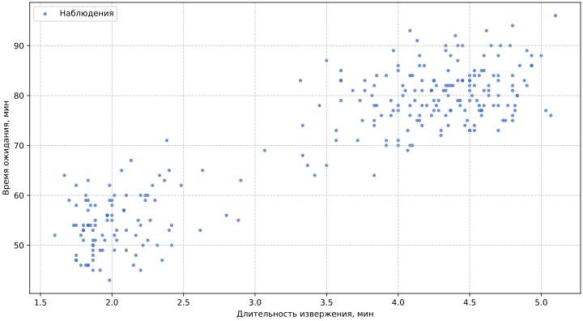
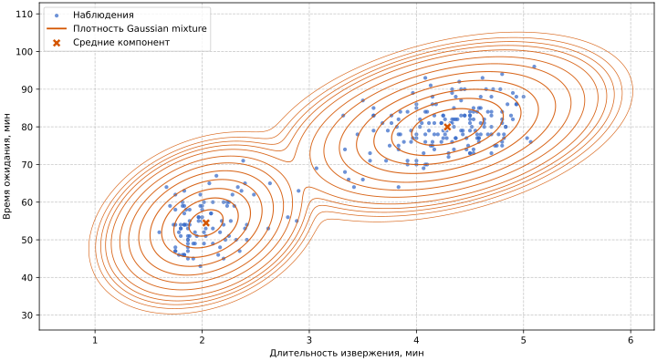

# Двухкомпонентная гауссовская смесь для данных Old Faithful

Полный код примера находится в [`examples/faithful_mixture_fit.rs`](https://github.com/hexqnt/gamlss/blob/main/examples/faithful_mixture_fit.rs).

Одно параметрическое семейство предполагает, что все наблюдения порождены одним распределительным механизмом. Это предположение не всегда естественно: в данных могут присутствовать несколько скрытых режимов, для которых заранее неизвестны метки. Конечная смесь описывает общую плотность как взвешенную сумму плотностей компонент и одновременно оценивает параметры каждого режима и их доли.

Рассмотрим классические данные Old Faithful. Одно наблюдение содержит длительность извержения в минутах и время ожидания следующего извержения в минутах:



$$
\mathbf Y_i=(Y_{i,\text{eruption}},Y_{i,\text{waiting}})^\mathsf T.
$$

На диаграмме рассеяния видны два облака: короткие извержения с небольшим ожиданием и длинные извержения с большим ожиданием. Будем моделировать их смесью двух двумерных нормальных распределений:

$$
p(\mathbf y_i\mid\theta)
=\sum_{c=0}^{1}\pi_c\,\phi_2(\mathbf y_i;\boldsymbol\mu_c,\boldsymbol\Sigma_c),
\qquad
\pi_c\geq 0,
\qquad
\pi_0+\pi_1=1.
$$

Здесь $c$ обозначает скрытую компоненту смеси, а не координату многомерного отклика. У каждой из двух компонент есть двумерный вектор средних и собственная ковариационная матрица. Все предикторы в примере содержат только свободный член, поэтому параметры не зависят от номера наблюдения: это вероятностная кластеризация совместного распределения, а не регрессия по признакам.

## Данные Old Faithful

Набор данных встроен в `gamlss-datasets` и загружается без операций ввода-вывода во время выполнения. `data.x` содержит номера наблюдений от 1 до 272, а `data.y` имеет тип `&[[f64; 2]]` и хранит пары `[eruption, waiting]`. Номера строк в этой модели не используются как предиктор.

```rust,ignore
{{#include ../../../examples/faithful_mixture_fit.rs:data}}
```

Две координаты измеряются в разных масштабах, но полная ковариационная матрица учитывает этот факт непосредственно. Для визуализации полезно подписывать оси единицами измерения и не интерпретировать наклон облака только по внешнему виду графика: безразмерную силу линейной связи лучше характеризует корреляция.

## Веса смеси и softmax с опорной компонентой

Веса должны принадлежать симплексу. Вместо независимой оптимизации двух ограниченных чисел модель использует один свободный логит $\alpha$ и фиксирует логит последней компоненты равным нулю:

$$
\pi_0=\frac{\exp(\alpha)}{\exp(\alpha)+1},
\qquad
\pi_1=\frac{1}{\exp(\alpha)+1}.
$$

Такое softmax-представление с опорной компонентой автоматически даёт неотрицательные нормированные веса и устраняет лишнюю степень свободы. В коде ему соответствует `SimplexLogitParameterBlock<MixtureWeight, 2, ...>` с одним предиктором, содержащим только свободный член.

Для $C$ компонент нужны $C-1$ свободных логитов. Последняя компонента является опорной только в параметризации: это не делает её статистически особенной и не означает, что она является контрольной группой в данных.

## Параметризация ковариационной матрицы

Каждая компонента задаётся семейством `MvNormalCholeskyDefault<2>`. Вместо непосредственной оптимизации трёх элементов симметричной ковариационной матрицы используется нижнетреугольный множитель Холецкого:

$$
\mathbf L_c=
\begin{pmatrix}
\exp(\eta_{c,00}) & 0 \\\\
\eta_{c,10} & \exp(\eta_{c,11})
\end{pmatrix},
\qquad
\boldsymbol\Sigma_c=\mathbf L_c\mathbf L_c^\mathsf T.
$$

Логарифмические link-функции на диагонали гарантируют положительные диагональные элементы. Поэтому при конечных предикторах получается положительно определённая ковариационная матрица без отдельного учёта матричных ограничений при оптимизации. Её элементы равны

$$
\boldsymbol\Sigma_c=
\begin{pmatrix}
L_{c,00}^2 & L_{c,00}L_{c,10} \\\\
L_{c,00}L_{c,10} & L_{c,10}^2+L_{c,11}^2
\end{pmatrix}.
$$

Внедиагональный элемент $L_{c,10}$ сам по себе не является ни ковариацией, ни корреляцией. Для отчёта пример получает элементы $\boldsymbol\Sigma_c$ через `theta.covariance` и вычисляет

$$
\rho_c=\frac{\Sigma_{c,10}}{\sqrt{\Sigma_{c,00}\Sigma_{c,11}}}.
$$

## Вложенная структура параметров

`Mixture<F, 2>` повторяет семейство компоненты `F` два раза и добавляет перед ними симплекс весов. Для текущей модели структура имеет вид

$$
(\text{weights},[(\boldsymbol\mu_0,\mathbf L_0),(\boldsymbol\mu_1,\mathbf L_1)]).
$$

Эту же структуру выражают блоки: один `SimplexLogitParameterBlock`, а затем массив из двух пар `VectorParameterBlock<Mu, 2, ...>` и `LowerTriangularParameterBlock<CholeskyScale, 2, ...>`.

```rust,ignore
{{#include ../../../examples/faithful_mixture_fit.rs:model}}
```

Число глобальных коэффициентов складывается следующим образом:

| Часть модели           | Коэффициентов на компоненту | Компонент | Всего коэффициентов |
| ---------------------- | --------------------------: | --------: | ------------------: |
| Свободные логиты весов |                           — |         — |                   1 |
| `Mu`                   |                           2 |         2 |                   4 |
| `CholeskyScale`        |                           3 |         2 |                   6 |
| Итого                  |                           — |         — |                  11 |

Каждый предиктор содержит только свободный член. Если заменить такой план на план с признаками, архитектура останется той же, но веса, средние или ковариационная структура смогут меняться между наблюдениями. Например, зависящий от признаков механизм выбора компоненты задаётся планом свободных логитов, а регрессия для отдельных компонент — планами соответствующих блоков `Mu`.

## Правдоподобие и скрытая принадлежность

Отрицательное логарифмическое правдоподобие одного наблюдения равно

$$
\ell_i=-\log\left(
\pi_0\phi_2(\mathbf y_i;\boldsymbol\mu_0,\boldsymbol\Sigma_0)
+\pi_1\phi_2(\mathbf y_i;\boldsymbol\mu_1,\boldsymbol\Sigma_1)
\right).
$$

Вычислять сумму плотностей напрямую численно ненадёжно, особенно в хвостах. `Mixture` объединяет логарифмические правдоподобия компонент с помощью приёма log-sum-exp, не вычисляя чрезвычайно малые плотности явно.

Апостериорная вероятность принадлежности наблюдения компоненте имеет вид

$$
r_{ic}
=P(Z_i=c\mid\mathbf y_i)
=\frac{\pi_c\phi_2(\mathbf y_i;\boldsymbol\mu_c,\boldsymbol\Sigma_c)}
{\sum_k\pi_k\phi_2(\mathbf y_i;\boldsymbol\mu_k,\boldsymbol\Sigma_k)}.
$$

Эти вероятности входят в аналитический градиент: производные по параметрам компоненты умножаются на её $r_{ic}$. На диаграмме рассеяния их можно показать непрерывной интенсивностью цвета либо назначать точке компоненту с максимальной вероятностью. Жёсткое назначение является производным представлением результата, а сама модель остаётся вероятностной.

## Почему важна инициализация

Две компоненты одной однородной смеси являются обменяемыми. Если начать с одинаковых средних, ковариационных множителей и весов, они получают одинаковые градиенты и могут остаться наложенными друг на друга. Автоматическое общее начальное приближение, подходящее для одного семейства, поэтому недостаточно для демонстрационного оценивания смеси.

Пример использует простую воспроизводимую эвристику: временно разделяет наблюдения по `waiting < 70`, а затем вычисляет внутри двух групп начальные средние, ковариационные матрицы и множители Холецкого. Начальный логит равен логарифму отношения размеров групп. Порог используется только для начального приближения; правдоподобие после этого оценивается на всех наблюдениях без известных меток компонент.

Для прикладной задачи обычно сравнивают несколько начальных приближений, используют предварительную кластеризацию или специализированный алгоритм. Разные успешные запуски могут поменять номера компонент местами, не изменив оценённую плотность.

## Оценивание параметров

Как и пример многомерной нормальной модели, эта глава сохраняет независимость библиотеки от оптимизатора и использует ручной градиентный спуск с поиском шага путём его последовательного сокращения. `ObjectiveScale::Mean` делит правдоподобие и его градиент на число наблюдений, чтобы характерный масштаб шага не зависел непосредственно от размера выборки.

```rust,ignore
{{#include ../../../examples/faithful_mixture_fit.rs:fit}}
```

На каждой итерации пример принимает только шаг, уменьшающий целевую функцию, и завершает цикл при норме градиента меньше $10^{-6}$. Это прозрачный учебный оптимизатор, но не универсальный способ оценивания смесей: для прикладной модели важны несколько начальных приближений, явный статус сходимости, ограничения масштаба и сравнение найденных локальных оптимумов.

Запустить пример можно командой

```bash
cargo run --example faithful_mixture_fit --features multivariate
```



## Интерпретация результата

Поскольку все блоки содержат только свободный член, `predict_theta_row` для любой строки возвращает один и тот же набор параметров на естественной шкале. Результат содержит нормированные веса и два `MvNormalCholeskyTheta`; для каждого из них доступны среднее, множитель Холецкого и элементы ковариационной матрицы.

```rust,ignore
{{#include ../../../examples/faithful_mixture_fit.rs:diagnostics}}
```

Текущий детерминированный запуск даёт приблизительно следующие оценки:

| Компонента |   Вес | Среднее `eruption` | Среднее `waiting` | Корреляция |
| ---------- | ----: | -----------------: | ----------------: | ----------: |
| 0          | 0.356 |              2.036 |            54.479 |       0.285 |
| 1          | 0.644 |              4.290 |            79.968 |       0.380 |

Первая компонента соответствует режиму коротких извержений и короткого ожидания, вторая — режиму длинных извержений и долгого ожидания. Это содержательная интерпретация после оценивания, а не встроенное значение номера компоненты. При другой инициализации те же два режима могут получить противоположные индексы.

Для графика естественно показать исходную диаграмму рассеяния, оценённые средние и эллипсы постоянного расстояния Махаланобиса для каждой $\boldsymbol\Sigma_c$. Веса можно отразить в подписях, а вероятности принадлежности — цветом точек. Эллипсы описывают геометрию распределений компонент, но не являются жёсткими границами кластеров.

## Идентифицируемость и вырождение

Перестановка компонент не меняет плотность смеси:

$$
\pi_0\phi_0(\mathbf y)+\pi_1\phi_1(\mathbf y)
=\pi_1\phi_1(\mathbf y)+\pi_0\phi_0(\mathbf y).
$$

Это переключение меток: параметры идентифицируются только с точностью до перестановки меток. Поэтому сравнивать компоненту 0 между двумя результатами оценивания можно лишь после осмысленного упорядочивания, например по среднему `waiting`.

У гауссовской смеси есть и более серьёзная особенность: правдоподобие не ограничено сверху, если одна ковариационная матрица стягивается к нулю вокруг отдельного наблюдения. На Old Faithful выбранное начальное приближение приводит к устойчивому содержательному решению, но это не устраняет проблему в общем случае. При прикладном оценивании полезны ограничения минимального масштаба, регуляризация ковариационных параметров, информативные априорные распределения или оптимизатор, специально учитывающий геометрию правдоподобия смеси.

Наконец, две нормальные компоненты не доказывают существование двух физических состояний. Смесь является моделью распределения; число компонент следует выбирать по качеству прогноза, устойчивости и предметной интерпретируемости, а не только по привлекательности диаграммы рассеяния.

## Возможные расширения

Та же типизированная структура допускает несколько направлений развития:

- сделать веса смеси зависимыми от признаков и получить модель смеси экспертов;
- задать отдельные регрессионные предикторы для средних каждой компоненты;
- заменить двумерное нормальное распределение на `MvStudentTCholesky`, если внутри режимов нужны тяжёлые совместные хвосты;
- увеличить число компонент, изменив константный параметр типа `C` и добавив $C-1$ блоков логитов;
- добавить штрафы к параметрам компонент или коэффициентам механизма их выбора;
- генерировать новые наблюдения из оценённой смеси при включённой возможности `rand`.

Рост гибкости усиливает проблемы локальных оптимумов и идентифицируемости. Поэтому полезно начинать с минимальной модели, в которой каждая дополнительная компонента или зависящий от признаков параметр имеет проверяемую роль.
